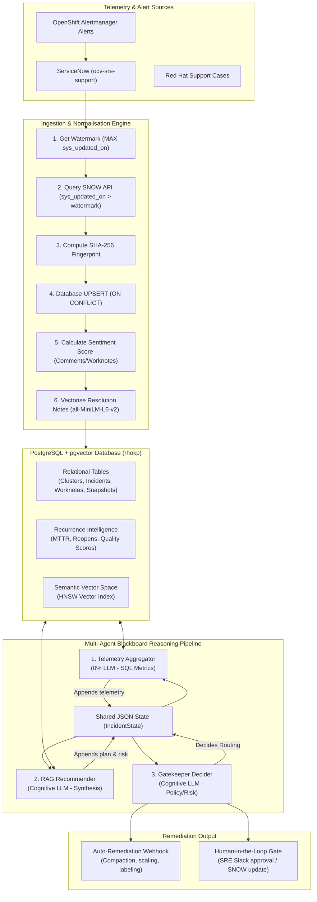
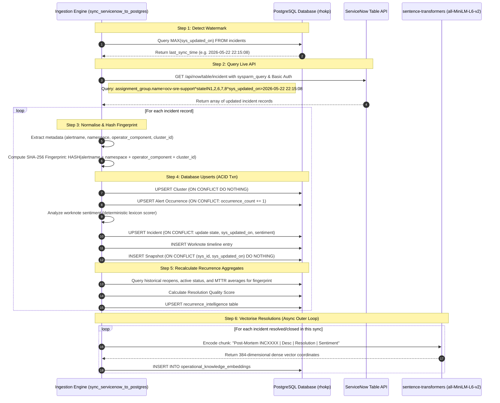
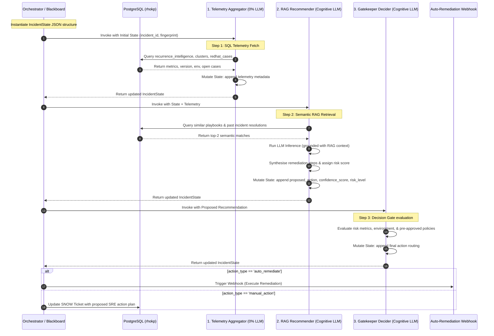

# AI-Powered OpenShift SRE Incident Intelligence Platform: System Synopsis & Architecture

This document provides a comprehensive technical overview of the OpenShift SRE Operational Intelligence, Incident Ingestion, and Recurrence Analysis platform. It defines the system's core purpose, high-level multi-agent pipeline, low-level ingestion mechanics, database design, and agent blackboard reasoning logic.

---

## 1. High-Level Overview & Architecture

### System Purpose
The SRE Incident Intelligence Platform is designed to automate the lifecycle of cluster-alert incidents on enterprise Red Hat OpenShift fleets. It aggregates incoming Alertmanager alerts, correlates them with ServiceNow (SNOW) incident states and Red Hat support tickets, pulls semantic context from runbook repositories (RAG), and routes evidence-backed remediation recommendations to automated webhooks or human operators.

### High-Level Logic Flow



---

## 2. Summary of Work Done So Far

1. **Relational & Vector Database Design**: Established a unified PostgreSQL schema with the `pgvector` extension and HNSW graph indexing for high-performance semantic search.
2. **Recursive Runbook Ingestion Engine ([sync_runbook_to_rag.py](file:///c:/Users/SRIMANDARBHA/Downloads/rag_testing/sync_runbook_to_rag.py))**:
   - Automated cloning/extraction fallback of the upstream `openshift/runbooks` repository.
   - Implemented markdown parsing and chunking aligned with standard Knowledge-Centered Service (KCS) sections (`MEANING`, `DIAGNOSIS`, `MITIGATION`).
   - Vectorized and stored 703 documentation chunks covering 262 unique alerts in the `rhokp_knowledge` vector table.
3. **Synthetic SRE Data Simulator ([generate_simulated_snow_data.py](file:///c:/Users/SRIMANDARBHA/Downloads/rag_testing/generate_simulated_snow_data.py))**:
   - Populated the database with 5 clusters, 25 alert occurrences, 8 Red Hat support cases, 55 ServiceNow incidents, 121 worknotes, 145 lifecycle snapshots, and computed long-term recurrence metrics.
   - Vectorized and indexed 30 dense incident post-mortems.
4. **Live ServiceNow Delta Synchronization Script ([sync_servicenow_to_postgres.py](file:///c:/Users/SRIMANDARBHA/Downloads/rag_testing/sync_servicenow_to_postgres.py))**:
   - Configured incremental updates querying ServiceNow using database-stored watermarks (`MAX(sys_updated_on)`).
   - Designed robust fallback regex parsing on ticket descriptions.
   - Automatically generates and writes dense 384-dimensional vector embeddings for closed incidents.
   - Includes a `--mock` mode to test delta synchronization offline.

---

## 3. Low-Level Ingestion & Sync Mechanics

The delta sync pipeline guarantees incremental extraction, schema normalization, deduplication, and vectorization.



### Ingestion Details

1. **Watermark Retrieval**:
   ```sql
   SELECT MAX(sys_updated_on) FROM incidents;
   ```
   If the database is empty, the timestamp defaults to `now - 30 days` to establish an initial synchronization baseline.

2. **Deduplication Hashing**:
   Deduplicating by alert name alone is highly dangerous, as it would merge incidents firing on different clusters or namespaces. The system generates a deterministic `SHA-256` fingerprint:
   ```python
   fingerprint = SHA256(alertname + namespace + operator_component + cluster_id)
   ```

3. **Database Conflict Management**:
   - **`alert_occurrences`**: Increments `occurrence_count` and updates `last_seen` timestamp.
   - **`incidents`**: Merges state, update timestamp, sentiment values, and replaces the JSONB payload.
   - **`incident_snapshots`**: Captures historical timeline changes. To prevent database bloating from high-frequency sync polling, snapshots enforce a composite unique constraint `(sys_id, sys_updated_on)` with `ON CONFLICT DO NOTHING`.

---

## 4. Low-Level Database Schema & Critique

### Relational + pgvector DDL Definition

```sql
-- Enable vector extension
CREATE EXTENSION IF NOT EXISTS vector;

-- 1. Clusters Table
CREATE TABLE IF NOT EXISTS clusters (
    cluster_id VARCHAR(50) PRIMARY KEY,
    name VARCHAR(100) NOT NULL,
    openshift_version VARCHAR(20) NOT NULL,
    environment VARCHAR(20) NOT NULL CHECK (environment IN ('production', 'staging', 'development', 'dr'))
);
CREATE INDEX IF NOT EXISTS idx_clusters_env ON clusters(environment);

-- 2. Alert Occurrence Tracking (Deduplicated Stream)
CREATE TABLE IF NOT EXISTS alert_occurrences (
    fingerprint VARCHAR(64) PRIMARY KEY, -- SHA-256 hash
    alertname VARCHAR(100) NOT NULL,
    namespace VARCHAR(100) NOT NULL,
    operator_component VARCHAR(100) NOT NULL,
    cluster_id VARCHAR(50) NOT NULL REFERENCES clusters(cluster_id) ON DELETE CASCADE,
    severity VARCHAR(20) NOT NULL,
    occurrence_count INT DEFAULT 1,
    active BOOLEAN DEFAULT TRUE,
    first_seen TIMESTAMP NOT NULL,
    last_seen TIMESTAMP NOT NULL
);
CREATE INDEX IF NOT EXISTS idx_alerts_lookup ON alert_occurrences(alertname, cluster_id, active);

-- 3. Red Hat Cases
CREATE TABLE IF NOT EXISTS redhat_cases (
    case_id VARCHAR(50) PRIMARY KEY,
    title TEXT NOT NULL,
    status VARCHAR(30) NOT NULL,
    severity VARCHAR(20) NOT NULL,
    created_on TIMESTAMP NOT NULL,
    closed_on TIMESTAMP,
    resolution TEXT
);

-- 4. Current ServiceNow Incident State
CREATE TABLE IF NOT EXISTS incidents (
    sys_id VARCHAR(32) PRIMARY KEY, -- SNOW sys_id
    number VARCHAR(20) UNIQUE NOT NULL, -- INCXXXX
    state VARCHAR(30) NOT NULL, -- New, WIP, Resolved, Closed, Reopened
    sys_created_on TIMESTAMP NOT NULL,
    sys_updated_on TIMESTAMP NOT NULL,
    short_description TEXT NOT NULL,
    cluster_id VARCHAR(50) REFERENCES clusters(cluster_id) ON DELETE SET NULL,
    alert_fingerprint VARCHAR(64) REFERENCES alert_occurrences(fingerprint) ON DELETE SET NULL,
    flapping_count INT DEFAULT 0,
    redhat_case_id VARCHAR(50) REFERENCES redhat_cases(case_id) ON DELETE SET NULL,
    sentiment_label VARCHAR(10) CHECK (sentiment_label IN ('positive', 'negative', 'neutral')),
    sentiment_score NUMERIC(5, 4),
    raw_payload JSONB
);
CREATE INDEX IF NOT EXISTS idx_incidents_state ON incidents(state);
CREATE INDEX IF NOT EXISTS idx_incidents_fingerprint ON incidents(alert_fingerprint);

-- 5. Incident Worknotes Timeline
CREATE TABLE IF NOT EXISTS incident_worknotes (
    id SERIAL PRIMARY KEY,
    sys_id VARCHAR(32) NOT NULL REFERENCES incidents(sys_id) ON DELETE CASCADE,
    worknote_text TEXT NOT NULL,
    created_on TIMESTAMP NOT NULL,
    sentiment_label VARCHAR(10) CHECK (sentiment_label IN ('positive', 'negative', 'neutral')),
    sentiment_score NUMERIC(5, 4)
);
CREATE INDEX IF NOT EXISTS idx_worknotes_sys_id ON incident_worknotes(sys_id, created_on DESC);

-- 6. Historical Ticket State Snapshots (Lifecycle Track)
CREATE TABLE IF NOT EXISTS incident_snapshots (
    snapshot_id SERIAL PRIMARY KEY,
    sys_id VARCHAR(32) NOT NULL REFERENCES incidents(sys_id) ON DELETE CASCADE,
    state VARCHAR(30) NOT NULL,
    sys_updated_on TIMESTAMP NOT NULL,
    changed_by VARCHAR(100) NOT NULL,
    worknotes_added TEXT,
    sentiment_label VARCHAR(10) CHECK (sentiment_label IN ('positive', 'negative', 'neutral')),
    sentiment_score NUMERIC(5, 4),
    CONSTRAINT unique_sys_id_updated UNIQUE (sys_id, sys_updated_on)
);
CREATE INDEX IF NOT EXISTS idx_snapshots_lookup ON incident_snapshots(sys_id, sys_updated_on DESC);

-- 7. Recurrence Intelligence Aggregates (Long-term retention)
CREATE TABLE IF NOT EXISTS recurrence_intelligence (
    fingerprint VARCHAR(64) PRIMARY KEY REFERENCES alert_occurrences(fingerprint) ON DELETE CASCADE,
    alertname VARCHAR(100) NOT NULL,
    operator_component VARCHAR(100) NOT NULL,
    cluster_id VARCHAR(50) REFERENCES clusters(cluster_id) ON DELETE CASCADE,
    total_occurrences INT DEFAULT 0,
    total_incidents INT DEFAULT 0,
    reopen_count INT DEFAULT 0,
    mttr_seconds BIGINT DEFAULT 0,
    resolution_quality_score NUMERIC(5, 2),
    last_reopened_at TIMESTAMP,
    updated_at TIMESTAMP NOT NULL
);

-- 8. Embeddings Table (Vector Storage for playbooks & post-mortems)
CREATE TABLE IF NOT EXISTS operational_knowledge_embeddings (
    id SERIAL PRIMARY KEY,
    source_id VARCHAR(100) NOT NULL,
    source_table VARCHAR(50) NOT NULL,
    text_chunk TEXT NOT NULL,
    embedding vector(384) NOT NULL
);
CREATE INDEX IF NOT EXISTS idx_vector_hnsw ON operational_knowledge_embeddings USING hnsw (embedding vector_l2_ops) WITH (m = 16, ef_construction = 64);
```

---

## 5. Low-Level Sentiment Analysis Engine

To calculate sentiment without invoking costly, high-latency LLM calls, the sync engine runs a deterministic keyword-based classifier that scans updates for specific technical expressions.

```python
POSITIVE_WORDS = ["fixed", "resolved", "stabilized", "restored", "normal", "healthy", "successful", "completed", "great", "excellent", "workaround", "optimal", "recovered"]
NEGATIVE_WORDS = ["error", "fail", "broken", "critical", "outage", "down", "severe", "incident", "issue", "crash", "degraded", "timeout", "saturation", "leak", "exhaustion"]

def analyze_sentiment(text):
    if not text:
        return "neutral", 0.5000
    text_lower = text.lower()
    pos_count = sum(text_lower.count(word) for word in POSITIVE_WORDS)
    neg_count = sum(text_lower.count(word) for word in NEGATIVE_WORDS)
    
    # Base score centered at 0.5; shifts by 0.12 per match
    score = 0.5 + (pos_count * 0.12) - (neg_count * 0.12)
    score = max(0.0, min(1.0, score))
    
    if score > 0.58:
        label = "positive"
    elif score < 0.42:
        label = "negative"
    else:
        label = "neutral"
        
    return label, round(score, 4)
```

---

## 6. Multi-Agent Blackboard Architecture

To ensure decoupling and scalability, the platform uses the **Blackboard Design Pattern**. Individual agents operate as independent workers that read and update a shared JSON payload (`IncidentState`).



### Shared `IncidentState` Schema

The JSON payload passed between agents contains the following structure:

```json
{
  "incident_id": "sysid_mock_new_0000000001",
  "number": "INC0099991",
  "alert_fingerprint": "ca3957a64a85289...",
  "cluster_id": "prod-us-east-1",
  "short_description": "Alert 'CoreDNSErrorsHigh' firing in namespace 'openshift-dns'",
  "operational_history": {
    "cluster_environment": "production",
    "openshift_version": "4.14.12",
    "total_alert_occurrences": 14,
    "total_incidents_for_alert": 3,
    "reopen_count": 1,
    "average_mttr_seconds": 3600,
    "last_reopened_at": "2026-05-22 18:00:00",
    "associated_redhat_cases": [
      {
        "case_id": "RH-12948192",
        "title": "CoreDNS packet drops under scaling stress",
        "status": "Closed",
        "resolution": "Adjusted DNS upstream timeout values in CoreDNS configmap"
      }
    ]
  },
  "remediation_plan": {
    "proposed_action": "Scale CoreDNS replicas to 3 and increase upstream timeouts to 15s in the Corefile configmap.",
    "confidence_score": 0.88,
    "risk_level": "medium",
    "reference_sources": [
      "playbook-dns-errors",
      "INC0000042"
    ]
  },
  "routing_decision": {
    "action_type": "manual_action",
    "assigned_to": "human-sre-queue",
    "reasoning": "The cluster is a production environment and the proposed action involves editing a cluster operator configmap (risk level: medium). Auto-remediation is restricted to development or staging for medium-risk items."
  }
}
```

### Detailed Agent Specifications

#### 1. Telemetry Aggregator Agent
* **Operational Value**: Gathers real-time operational context without LLM overhead. Keeping this step deterministic saves API cost and prevents hallucinations in structural fields.
* **Logic & Input**: Reads `incident_id` and `alert_fingerprint` from the shared state.
* **Database Interactions**:
  - Queries `recurrence_intelligence` to fetch historical alerts, incident counts, reopen counts, and average MTTR.
  - Queries `clusters` to fetch OpenShift versions and environment labels.
  - Queries `redhat_cases` to pull linked case titles, status, and resolutions.
* **Output Mutations**: Writes the `operational_history` dictionary into the shared `IncidentState`.

#### 2. RAG Recommender Agent
* **Operational Value**: Synthesizes verified playbook instructions and historical post-mortems into a step-by-step remediation plan.
* **Logic & Input**: Reads `short_description` and `operational_history` from the shared state.
* **Database Interactions**: Runs a hybrid semantic query against vector embeddings to pull matching runbook sections and resolved ticket summaries:
  ```sql
  SELECT source_id, source_table, text_chunk, (embedding <-> %s::vector) AS distance
  FROM operational_knowledge_embeddings
  ORDER BY embedding <-> %s::vector
  LIMIT 2;
  ```
* **LLM Prompt Grounding**: Builds a system instruction template restricting the model's output to the retrieved context, forcing OpenShift-compliant commands (`oc` instead of `kubectl`), and outputting JSON.
* **Output Mutations**: Writes `remediation_plan` containing the proposed actions, confidence scores, risk levels, and source references.

#### 3. Gatekeeper Decider Agent
* **Operational Value**: Minimizes operational risk by restricting automated changes based on cluster criticality, confidence thresholds, and system policy.
* **Logic & Input**: Evaluates the gathered `operational_history` and `remediation_plan`.
* **Decision Policies**:
  - **Reoccurrence & LLM Evaluation**: If the alert has recurred frequently (e.g., >= 5 occurrences in the last 7 days), the agent queries the cognitive LLM to determine if the proposed automated remediation plan is unlikely to fix the underlying issue permanently. If the LLM decides it won't resolve the root cause, the incident is escalated to the human queue (`manual_action`). If the LLM is offline, a rule-based fallback heuristic is applied.
  - **Critical Environment Isolation**: If `cluster_environment == 'production'` and `risk_level != 'low'`, force `action_type = 'manual_action'`.
  - **Confidence Guardrail**: If `confidence_score < 0.70`, force `action_type = 'manual_action'`.
  - **Auto-Remediation Check**: If the environment is staging/development and the alert is not escalated by the reoccurrence or confidence policies, set `action_type = 'auto_remediate'`.
* **Output Mutations**: Writes `routing_decision` containing the execution path, target queue, and logical reasoning.

### Design for Future Scalability

Because agents interact through a standardized blackboard structure, **new requirements can be met by simply registering new agents in the pipeline** without modifying existing agent code. For example:
- **Cost Optimizer Agent**: Could be inserted after the Recommender to assess cloud infrastructure overhead (e.g., node autoscaling costs) before decision gate-keeping.
- **SLA Forecaster Agent**: Could evaluate current queue sizes and calculate estimated times to resolution (ETTR).
- **Compliance Audit Agent**: Could run static analysis on proposed remediation plans to verify compliance with internal security guidelines.
